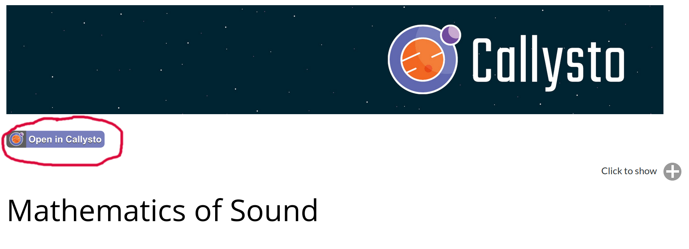

# About this Electronic Book
This electronic book (e-book) is a collection of free, online curriculum-tied notebooks designed by the [Callyso project](https://callysto.ca). 

The notebooks listed in this e-book are built using Jupyter notebook technology – a free, online software platform where you can use or share live code. 

## E-book purpose
The purpose of this e-book is to help Grades 5-12 teachers search for, or browse through curriculum notebooks which best suit their classroom. 

Because the e-book is designed for browsing purposes, the code within the notebooks does not fully function. See the section below to learn now to use the notebooks. 

## E-book license
This e-book is licensed under the Creative Commons 4.0 licence. This means you can modify or use the notebooks as you see fit. For more details, click [here](copyright.md). 

## E-book Creators

* [**Pacific Institute for the Mathematical Sciences**](http://www.pims.math.ca) - *PIMS is dedicated to promoting excellence in the mathematical sciences, enriching public education, and creating partnerships with similar organizations around the world.* 

* [**Cybera**](https://www.cybera.ca) - *Cybera is Alberta's not-for-profit organization responsible for driving economic growth through the use of digital technology, overseeing the development and operations of Alberta's cyberinfrastructure.* 

See also the list of [contributors](https://github.com/callysto/curriculum-notebooks/graphs/contributors) who participated in this project.

## Getting Started

Once you've found a notebook in this e-book collection, do the following to open it in the cloud:

**1.** Click the button “Open in Callysto” that appears near the top of the notebook.

> 

**2.** Sign into the Callysto Hub using a Google or Microsoft account. 

When you click “Open in Callysto”, you’ll see the Callysto Hub page (screen shot below). The Callysto Hub is where you’ll create your free, online workspace for the Callysto notebooks you open. No personal information is stored when you log into the Hub.

> 

**3.** View our “Use Callysto” guide

Click [here](https://callysto.ca/get-started/) to view “Use Callysto” materials. These materials will give you an overview of how to use the Callysto notebooks. 

**4.** If you have any questions, please email <contact@callysto.ca> 

## Built With

* [Callysto](http://callysto.ca) - A CanCode-funded project for digital literacy. 

* [Syzygy](http://syzygy.ca) - Providing access to cloud-based supercomputing resources and cloud hosting of notebooks.

## Contributing to the E-book

If you are a Grades 5-12 teacher in Canada interested in adding notebooks to, or improving existing notebooks in this e-book, please email <contact@callysto.ca> We welcome interest and suggestions from collaborators in both industry and academia

## Acknowledgments

* The Callysto project is funded by Canada's CanCode Grant.
* We appreciate Fernando Perez and his team at Berkeley for maintaining Jupyter. Thank you for meeting with us to provide project insights and collaboration.
* A special thanks to all of the teachers whose collaboration and support has been a key part of the project.
